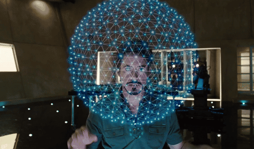

# New Element - Iron Man - Mediapipe

An interactive WebGL experience where your **face and hand movements** control a fully immersive 3D environment rendered in real-time using Three.js and Google MediaPipe.

For this creation, I was inspired by the New Element scene from *Iron Man 2*.



---

## Features

- **Face Tracking** — Your head position controls the camera perspective of the 3D room in real time. Look left, right, up, or down to explore the scene.
- **Hand Tracking** — Move your hand in front of the camera and use only **thumb and index distance** to control zoom on the central 3D object.
- **Hand Overlay** — A live hand-landmark overlay is rendered on top of the webcam preview, including highlighted thumb/index tips and connection lines.
- **3D Particle Sphere** — A glowing tech sphere sits at the center of a fully rendered grid room, built with Three.js and post-processed with Unreal Bloom for a cinematic look.
- **Grid Room Environment** — A dark, sci-fi-inspired room with grid lines on all sides (floor, ceiling, back, left and right walls).
- **Responsive Webcam Preview** — A floating webcam preview in the bottom-right, expanded to near full width on mobile.
- **Detection Status Badges** — Real-time indicators in the top-right showing whether a face and/or hand is currently detected.

---

## Tech Stack

| Technology                                                                   | Purpose                           |
| ---------------------------------------------------------------------------- | --------------------------------- |
| [React 19](https://react.dev)                                                | UI framework                      |
| [Three.js](https://threejs.org)                                              | 3D rendering engine               |
| [MediaPipe FaceMesh](https://google.github.io/mediapipe/solutions/face_mesh) | Real-time face landmark detection |
| [MediaPipe Hands](https://google.github.io/mediapipe/solutions/hands)        | Real-time hand landmark detection |
| [Vite](https://vitejs.dev)                                                   | Build tool & dev server           |
| [TypeScript](https://www.typescriptlang.org)                                 | Type safety                       |
| [Tailwind CSS](https://tailwindcss.com)                                      | UI styling (via CDN)              |
| [Lucide React](https://lucide.dev)                                           | Icon library                      |

---

## Getting Started

### Prerequisites

- **Node.js** v18 or higher
- **npm** v9 or higher
- A browser with **WebGL** and **webcam** support (Chrome/Edge recommended)

### Installation

```bash
# 1. Clone the repository
git clone https://github.com/andreaiannarone/new-element-iron-man-mediapipe.git
cd new-element-iron-man-mediapipe

# 2. Install dependencies
npm install

# 3. Start the development server
npm run dev
```

Then open [http://localhost:3000](http://localhost:3000) in your browser.

> **Note:** Camera permission required. The app will request access to your webcam when loaded. Make sure to allow it.

### Build for Production

```bash
npm run typecheck
npm run build
npm run check
npm run preview
```

`npm run check` runs the full project validation: TypeScript type-checking and production build.

## Hand Tracking Tuning

Hand tracking and zoom behavior are configured in [components/FaceTrackingRoom.tsx](components/FaceTrackingRoom.tsx).

### Hand Tracking Quality (`HAND_TRACKING_QUALITY`)

- `modelComplexity`: `1`
- `minDetectionConfidence`: `0.65`
- `minTrackingConfidence`: `0.6`
- `inputWidth`: `960`
- `inputHeight`: `720`
- `landmarkSmoothing`: `0.58`

Hand zoom sensitivity is controlled in [components/FaceTrackingRoom.tsx](components/FaceTrackingRoom.tsx) via `HAND_ZOOM_SENSITIVITY`:

- `openGestureRatio`: raise it if you want more thumb-index separation before reaching maximum zoom.
- `closedGestureRatio`: lower it if you want the fingers to get closer before reaching minimum zoom.
- `maxTipDepthDelta`: lower it to ignore more one-finger-forward false positives.
- `scaleSmoothing`: lower it for smoother, slower zoom transitions.
- `spreadSmoothing`: lower it to filter noisy thumb-index distance changes more aggressively.
- `gestureDeadZoneRatio`: raise it to ignore tiny involuntary finger movements around the current zoom level.
- `maxScaleStep`: lower it if you want smaller, more precise zoom changes per frame.

Current defaults:

- `openGestureRatio`: `1.55`
- `closedGestureRatio`: `0.03`
- `maxTipDepthDelta`: `0.14`
- `scaleSmoothing`: `0.24`
- `spreadSmoothing`: `0.4`
- `gestureDeadZoneRatio`: `0.035`
- `maxScaleStep`: `0.06`

To get more control margin between thumb and index, increase `openGestureRatio` and decrease `closedGestureRatio` so the full zoom range is spread across a wider finger movement.

If the hand disappears or the thumb/index pose becomes too ambiguous for a few frames, the sphere returns to a neutral scale instead of staying stuck on the last zoom value.
The loading banner is rendered above all UI layers and the mobile layout uses dynamic viewport height so the 3D canvas fills the visible screen height.

---

## How to Use

| Action                                    | Effect                                       |
| ----------------------------------------- | -------------------------------------------- |
| Move your **head left/right**             | Camera pans and the room slides horizontally |
| Move your **head up/down**                | Camera tilts and the room shifts vertically  |
| **Separate** thumb and index             | The central sphere expands                   |
| **Bring together** thumb and index       | The central sphere shrinks                   |

---

## Project Structure

```
/
├── App.tsx                   # Root component with layout
├── index.tsx                 # React entry point
├── index.html                # HTML shell
├── types.ts                  # Shared TypeScript types & default config
├── vite.config.ts            # Vite configuration
├── components/
│   ├── FaceTrackingRoom.tsx  # Main 3D scene + MediaPipe tracking logic
│   ├── TechSphere.ts         # Three.js tech sphere mesh factory
│   ├── AtomBloom.ts          # Bloom/glow effect helper
│   ├── ParticleSphere.tsx    # Particle sphere renderer (canvas-based)
│   ├── Controls.tsx          # Settings panel UI
│   └── WebcamWindow.tsx      # Floating webcam preview widget
└── src/
    └── white_square.jpg      # Static asset
```

---

## Configuration (SphereConfig)

The sphere can be customized by editing `types.ts` or using the in-app settings panel:

| Property             | Default   | Description                                                    |
| -------------------- | --------- | -------------------------------------------------------------- |
| `particleCount`      | `800`     | Number of particles                                            |
| `radius`             | `200`     | Sphere radius                                                  |
| `rotationSpeedX`     | `0.002`   | Auto-rotation speed on X axis                                  |
| `rotationSpeedY`     | `0.004`   | Auto-rotation speed on Y axis                                  |
| `colorBase`          | `#60a5fa` | Base particle color (Blue-400)                                 |
| `colorGlow`          | `#3b82f6` | Glow/bloom color (Blue-500)                                    |
| `particleSize`       | `1.5`     | Size of each particle dot                                      |
| `connectionDistance` | `50`      | Max distance to draw lines between particles (`0` = dots only) |
| `perspective`        | `800`     | Camera perspective depth                                       |

---

## MediaPipe (CDN-only)

MediaPipe is loaded dynamically at runtime via CDN — no local installation required:

- `@mediapipe/face_mesh` — via jsDelivr
- `@mediapipe/hands` — via jsDelivr
- `@mediapipe/camera_utils` — via jsDelivr

---

## License

This project is licensed under the **GNU General Public License v3.0 (GPL-3.0)**.
See the [LICENSE](./LICENSE) file for full details.

---

Digital experience by **<a href="https://andreaiannarone.com">Andrea Iannarone</a>**
