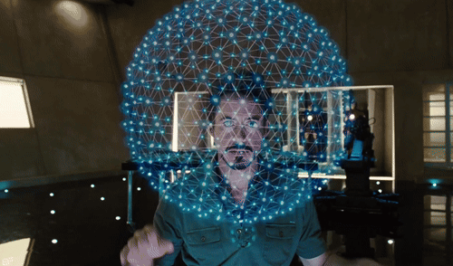

# New Element

> Your webcam becomes the controller. Move your head to explore a 3D sci-fi room, pinch your fingers to shape the element.

[](https://newelement.andreaia.com/)
[](./LICENSE)
[](https://threejs.org)
[](https://react.dev)
[](https://www.typescriptlang.org)

An interactive WebGL experience where face and hand movements control a fully immersive 3D
environment, rendered in real time with Three.js and Google MediaPipe. A tribute to the
"new element" laboratory scene from *Iron Man 2*.

Everything runs on your device: the webcam stream is processed in the browser and never
leaves it.



---

## How to use

| Action | Effect |
| --- | --- |
| Move your **head** left / right | Camera pans, the room slides horizontally |
| Move your **head** up / down | Camera tilts, the room shifts vertically |
| **Separate** thumb and index | The central sphere expands |
| **Bring together** thumb and index | The central sphere shrinks |
| Click the **i** button, bottom left | Opens the project panel (Esc, the close button or a click outside dismisses it) |
| Pick a language in that panel | Switches its copy between EN, IT, ES, FR and DE |

Grant camera access when the browser asks, and keep your face and hand evenly lit: tracking
degrades in low or uneven light.

---

## Quick start

```bash
git clone https://github.com/andreaiannarone/new-element-iron-man-mediapipe.git
cd new-element-iron-man-mediapipe
npm install
npm run dev
```

Open [http://localhost:3000](http://localhost:3000). Requires **Node.js v20.19+ or v22.12+**
(Vite 8), npm v10+, and a browser with WebGL and webcam support (Chrome or Edge recommended).

| Script | What it does |
| --- | --- |
| `npm run dev` | Dev server on port 3000 |
| `npm run build` | Production build |
| `npm run preview` | Serve the production build |
| `npm run typecheck` | TypeScript, no emit |
| `npm run check` | Typecheck + build - run this before committing |

> **Serve over HTTPS in production.** `getUserMedia` requires a secure context; on plain HTTP
> camera access fails silently.

---

## How it works

- **Head to camera** - MediaPipe FaceMesh reads facial landmarks each frame; horizontal and
  vertical head position pan and tilt the Three.js camera, so the room parallaxes with you.
- **Pinch to zoom** - MediaPipe Hands tracks 21 hand landmarks. The smoothed distance between
  thumb tip and index tip maps to the sphere's scale.
- **Recovery** - if the hand leaves the frame or the pose stays ambiguous for a few frames,
  the sphere eases back to a neutral scale instead of freezing on the last value.
- **On-device inference** - MediaPipe runs client-side through WebAssembly, loaded from
  jsDelivr at runtime. No frames are uploaded, recorded or stored.

### Tech stack

**[React 19](https://react.dev)** + **[TypeScript](https://www.typescriptlang.org)** for the
interface · **[Three.js](https://threejs.org)** for WebGL rendering and Unreal Bloom
post-processing · **[MediaPipe FaceMesh](https://google.github.io/mediapipe/solutions/face_mesh)**
and **[Hands](https://google.github.io/mediapipe/solutions/hands)** for landmark detection ·
**[Tailwind CSS](https://tailwindcss.com)** compiled at build time ·
**[Vite](https://vitejs.dev)** · **[Lucide](https://lucide.dev)** for icons.

---

## Project structure

```
├── App.tsx                   # Root layout and info button
├── index.tsx                 # React entry point
├── index.css                 # Tailwind entry point + font theme
├── index.html                # HTML shell, meta tags & static fallback content
├── types.ts                  # Shared types & default sphere config
├── components/
│   ├── FaceTrackingRoom.tsx  # 3D scene + MediaPipe tracking logic
│   ├── AboutDialog.tsx       # Project panel (native <dialog>)
│   ├── aboutTranslations.ts  # Panel copy in EN / IT / ES / FR / DE
│   ├── TechSphere.ts         # Tech sphere mesh factory
│   ├── AtomBloom.ts          # Bloom/glow helper
│   ├── WebcamWindow.tsx      # Floating webcam preview
│   ├── Controls.tsx          # Settings panel (not currently mounted)
│   └── ParticleSphere.tsx    # Canvas particle sphere (not currently mounted)
└── public/                   # Icons, manifest and SEO files
```

---

## Configuration

### Sphere

Defaults live in [`types.ts`](types.ts).

| Property | Default | Description |
| --- | --- | --- |
| `particleCount` | `800` | Number of particles |
| `radius` | `200` | Sphere radius |
| `rotationSpeedX` / `Y` | `0.002` / `0.004` | Auto-rotation speed |
| `colorBase` / `colorGlow` | `#60a5fa` / `#3b82f6` | Particle and glow colour |
| `particleSize` | `1.5` | Size of each dot |
| `connectionDistance` | `50` | Max distance for connecting lines (`0` = dots only) |
| `perspective` | `800` | Camera perspective depth |

### Hand tracking

Tuned in [`components/FaceTrackingRoom.tsx`](components/FaceTrackingRoom.tsx) via
`HAND_TRACKING_QUALITY` and `HAND_ZOOM_SENSITIVITY`.

| Parameter | Default | Raise it to... |
| --- | --- | --- |
| `openGestureRatio` | `1.55` | require wider thumb-index separation for max zoom |
| `closedGestureRatio` | `0.03` | reach minimum zoom with fingers further apart |
| `maxTipDepthDelta` | `0.14` | accept more one-finger-forward poses |
| `scaleSmoothing` | `0.24` | make zoom snappier (lower = smoother) |
| `spreadSmoothing` | `0.4` | react faster to distance changes (lower = calmer) |
| `gestureDeadZoneRatio` | `0.035` | ignore more involuntary finger movement |
| `maxScaleStep` | `0.06` | allow larger zoom jumps per frame |

For more control margin, raise `openGestureRatio` and lower `closedGestureRatio`: the zoom
range then spreads across a wider finger movement.

---

## SEO & GEO

The app renders to a `<canvas>`, so crawlers and AI agents would otherwise see an empty
document. Discoverability is handled entirely in static HTML:

| File | Purpose |
| --- | --- |
| `index.html` | Meta tags, Open Graph, Twitter cards, JSON-LD (`WebSite`, `Person`, `WebApplication`, `HowTo`, `FAQPage`), inlined critical CSS, and a static description inside `#root` - the no-JavaScript version of the page, which React replaces on mount |
| `public/robots.txt` | Allows search crawlers and, explicitly, AI agents (GPTBot, ClaudeBot, PerplexityBot, Google-Extended, …) |
| `public/sitemap.xml` | Single-URL sitemap with image annotation |
| `public/llms.txt` | Plain-text summary for language models ([llmstxt.org](https://llmstxt.org)) |
| `public/og-image.jpg` | 1200×630 social preview |
| `public/site.webmanifest` + icons | Installable PWA metadata |

Every absolute URL points to `https://newelement.andreaia.com`. To deploy elsewhere:

```bash
grep -rl "newelement.andreaia.com" index.html public/ README.md \
  | xargs sed -i '' 's|newelement.andreaia.com|YOUR-DOMAIN.com|g'
```

---

## License

[GNU General Public License v3.0](./LICENSE).

Independent fan project, not affiliated with, endorsed by or sponsored by Marvel or
The Walt Disney Company. *Iron Man* and related names are trademarks of their respective owners.

---

Creative experience by **[Andrea Iannarone](https://andreaiannarone.com)**
